<div align="center">





<table>
<tr>
<td width="370" valign="top">



</td>
<td width="490" valign="top">



</td>
</tr>
</table>



</div>

```console
$ whoami
puneetai7 — building agentic systems that read the market before it moves

$ ls ~/shipping
TrendPulse/   5-agent pipeline: topic in, validated business concept out
              9 live data sources · leading indicators · traceable business case

$ cat ~/.config/interests
leading indicators > lagging dashboards
GitHub, Stack Overflow, research papers and SEC filings move 6–18 months
before consumer search does. I build things that read that gap.
```

<details>
<summary><code>$ how is this README built?</code></summary>

Everything above is a generated SVG — no GIFs, no external services.

| Piece | Script | Output |
| --- | --- | --- |
| Banner | `scripts/make_banner.py` | `banner.svg` |
| Contribution heatmap | `scripts/fetch_contributions.py` → `scripts/render_heatmap_svg.py` | `contrib-heatmap.svg` |
| ASCII portrait | `scripts/prep_photo.py` → `scripts/make_ascii_svg.py` | `avi-ascii.svg` |
| Info card | `scripts/make_info_card.py` | `info-card.svg` |
| Language mix | `scripts/make_lang_bar.py` | `lang-bar.svg` |

The animation is pure CSS keyframes inside each SVG. GitHub serves README
images through an `` tag, which runs declarative animation but no
JavaScript — so the cells drop in, the portrait types itself row by row, and
the card lines slide in, all without a single script tag.

Every animated element's *base* state is its finished state, with
`animation-fill-mode: both`. Anything that ignores CSS animation still renders
a complete, readable graphic instead of a blank box.

**Rebuild it yourself**

```bash
python -m venv .venv && source .venv/bin/activate
pip install -r scripts/requirements.txt

python scripts/fetch_contributions.py
python scripts/render_heatmap_svg.py
python scripts/make_info_card.py
python scripts/make_banner.py
python scripts/make_lang_bar.py
```

The portrait is a one-time step and needs the heavier image dependencies:

```bash
pip install -r scripts/requirements-photo.txt
python scripts/prep_photo.py path/to/photo.jpg
python scripts/make_ascii_svg.py
```

Text on the card lives in `data/profile.json`; the counts and language mix on
it are pulled live from the public GitHub API. `.github/workflows/update-profile-art.yml`
re-runs the heatmap and card every morning and commits the result.

</details>
